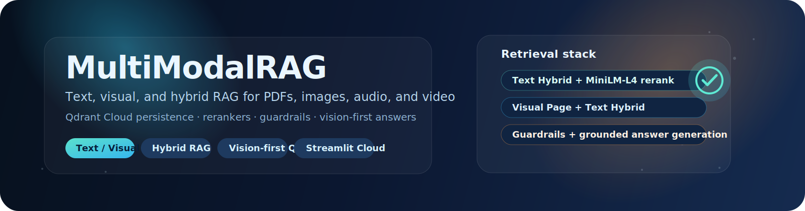
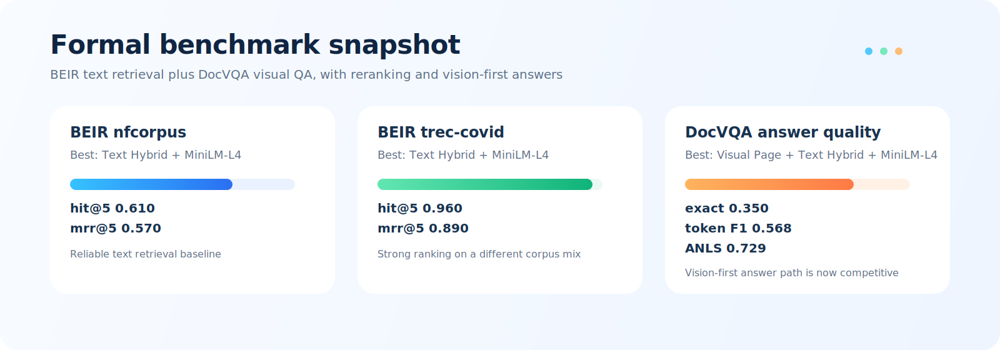

# Multimodal RAG Q&A System

<p align="center">
  
</p>

## Demo Video

<p align="center">
  <video src="assets/demo.mp4" controls width="100%"></video>
</p>

If the embedded video does not render in your viewer, open it directly here:

- [assets/demo.mp4](assets/demo.mp4)

This project is a multimodal RAG demo for text, PDF, image, audio, and video assets. It supports text, visual, and hybrid retrieval; Qdrant Cloud persistence; guardrails; reranking; and grounded answers from `gpt-5-nano`.

OpenAI is used only for final chat answer generation. Retrieval and non-text handling are local and free/open-source. Without an API key, the app still works in retrieval-only mode.

## Status


## Live Demo

The project is live on Streamlit Community Cloud:

- [Open the public demo](https://multimodalrag-zqcgs36wwctqct7u9tvjvu.streamlit.app/)

Viewers can open the app and paste their own OpenAI and Qdrant credentials in the sidebar. If they do not enter an API key, the app still works in retrieval-only mode.

## Pipeline Mapping

- Extraction: text, Markdown, PDF text, CSV rows, image assets, and optional sampled video frames.
- Modality conversion: text/PDF/CSV are converted to text; images and video frames run through optional OCR, optional VLM hooks, manual correction fields, and local visual feature summaries.
- Chunking: text uses overlapping text chunks, CSV uses row chunks, PDFs can use lightweight page chunks or optional Docling structure-aware section chunks, images use one asset chunk, and video uses one chunk per sampled frame.
- Encoding: extracted text evidence uses local sentence-transformers by default, with TF-IDF as a fallback. Image and video frames also keep lightweight PIL/NumPy visual metadata.
- Retrieval: local/open-source retrieval ranks searchable chunk text in one shared index. Modes include Qdrant Cloud, Qdrant Cloud hybrid, in-memory Qdrant, Qdrant hybrid, FAISS semantic search, FAISS hybrid search, semantic, TF-IDF, hybrid score fusion, parent-child expansion, and step-back query rewriting for hybrid or parent-child retrieval. No OpenAI embeddings are used.
- Grounded generation: top evidence is packed into a prompt and sent to `gpt-5-nano` only when an API key is available.

## Formal Evaluation

<p align="center">
  
</p>

### Evaluation Protocol

The formal campaign used three small but representative benchmark slices:

- BEIR `nfcorpus` for general text retrieval
- BEIR `trec-covid` for text retrieval under a different corpus distribution
- DocVQA validation slices for document-image retrieval and answer quality

We reported retrieval metrics with `hit@5`, `mrr@5`, and `recall@5`, then added answer-side metrics for DocVQA with `normalized_exact_match`, `contains_expected`, `token_f1`, and `anls`.

The suite compares:

- text-only retrieval
- visual page retrieval
- visual + text hybrid retrieval
- answer generation with and without visual evidence
- reranking effects with `MiniLM-L4`

This is intended to be persuasive for a GitHub release because it shows:

- a standard text benchmark baseline
- a document-image benchmark baseline
- the effect of visual retrieval
- the effect of reranking
- the effect of a vision-first answer path

The current system has a completed formal experiment suite. The results are saved in `eval/results/` and summarized in:

- `eval/results/formal_full_system_report.csv`
- `eval/results/formal_full_system_comparison.csv`

Headline results from the formal runs:

| Benchmark | Best setting | Key result |
| --- | --- | --- |
| BEIR `nfcorpus` | `Text Hybrid + MiniLM-L4` | `hit@5 = 0.610`, `mrr@5 = 0.570` |
| BEIR `trec-covid` | `Text Hybrid + MiniLM-L4` | `hit@5 = 0.960`, `mrr@5 = 0.890` |
| DocVQA small answer quality | `Visual Page + Text Hybrid + MiniLM-L4` | `normalized_exact_match = 0.350`, `contains_expected = 0.750`, `token_f1 = 0.568`, `anls = 0.729` |

Key takeaways:

- `MiniLM-L4` improved text retrieval ranking quality in the formal BEIR runs.
- Visual page retrieval plus text hybrid retrieval was the strongest multimodal retrieval setting on DocVQA.
- The vision-first answer path is now the best multimodal answer configuration in the formal suite.

Complete formal results:

| Run | Mode | Key metrics |
| --- | --- | --- |
| `formal_beir_nfcorpus_text_l4_off_v1` | `Text Hybrid` | `hit@5 = 0.610`, `mrr@5 = 0.570` |
| `formal_beir_trec_covid_text_l4_off_v1` | `Text Hybrid` | `hit@5 = 0.960`, `mrr@5 = 0.890` |
| `formal_docvqa_small_text_off_v1` | `Text Hybrid` | `hit@5 = 1.000`, `mrr@5 = 0.804`, `normalized_exact_match = 0.050`, `contains_expected = 0.100`, `token_f1 = 0.077`, `anls = 0.172` |
| `formal_docvqa_small_text_answer_v1` | `Text Hybrid` | `hit@5 = 1.000`, `mrr@5 = 0.804`, `normalized_exact_match = 0.000`, `contains_expected = 0.050`, `token_f1 = 0.064`, `anls = 0.170` |
| `formal_docvqa_small_visual_hybrid_l4_off_v1` | `Visual Page + Text Hybrid` | `hit@5 = 1.000`, `mrr@5 = 0.893`, `normalized_exact_match = 0.400`, `contains_expected = 0.750`, `token_f1 = 0.633`, `anls = 0.666` |
| `formal_docvqa_small_visual_hybrid_l4_answer_v1` | `Visual Page + Text Hybrid` | `hit@5 = 1.000`, `mrr@5 = 0.893`, `normalized_exact_match = 0.350`, `contains_expected = 0.750`, `token_f1 = 0.568`, `anls = 0.729` |

Development benchmark results are also preserved in `eval/results/all_runs_comparison.csv` for the full run history, including the intermediate retrieval-only and answer-quality experiments used to stabilize the final formal suite.

The main conclusion from the formal campaign is that the multimodal answer path is now competitive with text-only answer generation on the DocVQA slice used here, while the retrieval pipeline remains stable across both BEIR text sets and visual document QA.

For the full run archive, see `RESULTS_SUMMARY.md` and `eval/results/all_runs_comparison.csv`.

## Complete Benchmark Archive

The table below lists the full evaluation history used to stabilize the final formal suite.

### BEIR Text Retrieval

| Run | Mode | Result |
| --- | --- | --- |
| `beir_nfcorpus_text_sanity` | `Text Hybrid` | `hit@5 = 0.800`, `mrr@5 = 0.750` |
| `beir_nfcorpus_text_off_v1` | `Text Hybrid` | `hit@5 = 0.560`, `mrr@5 = 0.479` |
| `beir_nfcorpus_text_v1` | `Text Hybrid` | `hit@5 = 0.560`, `mrr@5 = 0.479` |
| `beir_nfcorpus_text_l4_off_v1` | `Text Hybrid` | `hit@5 = 0.610`, `mrr@5 = 0.570` |
| `beir_nfcorpus_text_l4_v1` | `Text Hybrid` | `hit@5 = 0.610`, `mrr@5 = 0.570` |
| `beir_trec_covid_text_sanity` | `Text Hybrid` | `hit@5 = 1.000`, `mrr@5 = 0.794` |
| `beir_trec_covid_text_off_v1` | `Text Hybrid` | `hit@5 = 0.960`, `mrr@5 = 0.825` |
| `beir_trec_covid_text_v1` | `Text Hybrid` | `hit@5 = 0.959`, `mrr@5 = 0.821` |
| `beir_trec_covid_text_l4_off_v1` | `Text Hybrid` | `hit@5 = 0.960`, `mrr@5 = 0.890` |
| `beir_trec_covid_text_l4_v1` | `Text Hybrid` | `hit@5 = 0.959`, `mrr@5 = 0.888` |

### DocVQA Retrieval

| Run | Mode | Result |
| --- | --- | --- |
| `docvqa_small_text_off_v1` | `Text Hybrid` | `hit@5 = 1.000`, `mrr@5 = 0.804` |
| `docvqa_small_visual_hybrid_off_v1` | `Visual Page + Text Hybrid` | `hit@5 = 0.950`, `mrr@5 = 0.829` |
| `docvqa_small_visual_hybrid_l4_off_v1` | `Visual Page + Text Hybrid` | `hit@5 = 1.000`, `mrr@5 = 0.893` |

### DocVQA Answer Quality

| Run | Mode | Result |
| --- | --- | --- |
| `docvqa_small_text_answer_full_v1` | `Text Hybrid` | `normalized_exact_match = 0.350`, `token_f1 = 0.488`, `anls = 0.688` |
| `docvqa_small_visual_hybrid_l4_answer_full_v1` | `Visual Page + Text Hybrid` | `normalized_exact_match = 0.100`, `token_f1 = 0.000`, `anls = 0.000` |
| `docvqa_small_visual_hybrid_l4_answer_full_v2` | `Visual Page + Text Hybrid` | `normalized_exact_match = 0.300`, `token_f1 = 0.421`, `anls = 0.582` |
| `docvqa_small_visual_hybrid_l4_answer_full_v3` | `Visual Page + Text Hybrid` | `normalized_exact_match = 0.000`, `token_f1 = 0.026`, `anls = 0.122` |
| `docvqa_small_visual_hybrid_l4_answer_full_v4` | `Visual Page + Text Hybrid` | `normalized_exact_match = 0.350`, `token_f1 = 0.561`, `anls = 0.707` |
| `formal_docvqa_small_text_answer_v1` | `Text Hybrid` | `normalized_exact_match = 0.000`, `contains_expected = 0.050`, `token_f1 = 0.064`, `anls = 0.170` |
| `formal_docvqa_small_text_off_v1` | `Text Hybrid` | `normalized_exact_match = 0.050`, `contains_expected = 0.100`, `token_f1 = 0.077`, `anls = 0.172` |
| `formal_docvqa_small_visual_hybrid_l4_answer_v1` | `Visual Page + Text Hybrid` | `normalized_exact_match = 0.350`, `contains_expected = 0.750`, `token_f1 = 0.568`, `anls = 0.729` |
| `formal_docvqa_small_visual_hybrid_l4_off_v1` | `Visual Page + Text Hybrid` | `normalized_exact_match = 0.400`, `contains_expected = 0.750`, `token_f1 = 0.633`, `anls = 0.666` |

If you want to rerun the suite locally:

```bash
python scripts/run_formal_full_system_experiment.py
```

To watch progress live:

```bash
streamlit run scripts/formal_experiment_dashboard.py --server.port 9015
```

## Local Run

```bash
cd MultiModalRAG
python -m venv .venv
source .venv/bin/activate
pip install -r requirements.txt
streamlit run app.py
```

For OCR on local uploads, install the Tesseract system binary:

```bash
# macOS
brew install tesseract

# Ubuntu/Debian
sudo apt-get install -y tesseract-ocr
```

## API Key Setup

Local Streamlit secrets:

```toml
# MultiModalRAG/.streamlit/secrets.toml
OPENAI_API_KEY = "sk-..."
```

The app also checks the `OPENAI_API_KEY` environment variable. Do not commit secrets.

You can also paste an OpenAI API key into the sidebar at runtime. That key is used only for the current Streamlit session and only for final chat answer generation.

For Qdrant Cloud, use `Qdrant Cloud` or `Qdrant Cloud hybrid` retrieval mode and paste the endpoint/API key into the sidebar. Building an index in these modes uploads local sentence-transformer vectors plus chunk metadata to the selected collection. After restarting the app, choose the same mode, paste the same endpoint/API key/collection, and click **Connect existing Qdrant collection** to query saved vectors without re-uploading files. Do not hardcode Qdrant credentials in source files.

Each question displays retrieval, step-back, answer-generation, and total latency so you can compare local FAISS, local Qdrant, and Qdrant Cloud behavior.

## Streamlit Community Cloud

1. Push this folder to GitHub.
2. Open Streamlit Community Cloud.
3. Create a new app from the repo.
4. Set the main file path to `MultiModalRAG/app.py`.
5. Add this secret in Advanced settings if you want generated answers:

```toml
OPENAI_API_KEY = "sk-..."
```

6. Deploy. If the secret is missing, the app runs in retrieval-only mode.

`packages.txt` installs `tesseract-ocr` and `ffmpeg` on Streamlit Community Cloud so OCR and media handling have the required system binaries.

## Retrieval Evaluation

Use `retrieval_strategy_evaluation.ipynb` to compare retrieval modes with controlled questions and gold chunk labels. The notebook runs each strategy, computes `hit@k`, `recall@k`, `precision@k`, `MRR@k`, `nDCG@k`, and latency, then saves CSV results and PNG charts under `eval/results/`.

The notebook creates a starter `eval/gold_questions.jsonl` from the bundled sample data if one does not already exist. Replace that JSONL file with manually labeled questions for larger corpora.

## Production Rebuild Map

The public/production design is the primary architecture this demo mirrors:

1. Store raw assets in S3 or an S3-compatible bucket.
2. Transcribe meeting audio with Whisper or faster-whisper.
3. Extract slide text and layout with Docling, Unstructured, or PaddleOCR.
4. Segment video by time or scene, sample frames, and run a VLM such as Qwen2.5-VL to produce segment descriptions.
5. Embed all extracted text into one shared index.
6. Store vectors plus metadata in pgvector, Qdrant, Milvus, or OpenSearch.
7. Retrieve top matches across AUDIO / SLIDE / VIDEO.
8. Pack context under a token budget.
9. Send grounded context to an answer model.

The Streamlit app includes a "Production target" table showing each production stage, the current demo fallback, and whether optional packages are installed. Heavy integrations are intentionally optional so the app still deploys to Streamlit Community Cloud and still works without an API key.

## Current Demo Fallbacks

| Production requirement | Demo implementation |
| --- | --- |
| S3 or S3-compatible bucket | Streamlit uploaded files and `sample_data/` |
| Whisper/faster-whisper audio transcription | Audio uploads and video audio tracks call `faster-whisper`; transcript uploads remain the lightweight fallback |
| Docling/Unstructured/PaddleOCR slide extraction | Optional Docling structure-aware PDF sections, pypdf fallback, slide notes, CSV rows, Tesseract OCR for images/video frames, manual visual descriptions |
| Video segmentation plus Qwen2.5-VL descriptions | OpenCV timestamped frame segments plus OCR, optional `gpt-5-nano` VLM descriptions, manual corrections, and local visual features |
| Shared text embeddings | Local sentence-transformers by default, TF-IDF fallback |
| pgvector/Qdrant/Milvus/OpenSearch | Optional Qdrant Cloud, in-memory Qdrant, in-memory FAISS, or TF-IDF matrix plus chunk metadata |
| Cross-modal retrieval | Top matches across all available chunk modalities |
| Token-budget packing | Approximate local packer before `gpt-5-nano` chat |
| Answer model | `gpt-5-nano` for VLM descriptions and grounded chat; retrieval-only fallback without key |

## Optional Production Packages

These are not in `requirements.txt` because they are heavier than the deployable MVP. Add them only in a production rebuild:

```text
boto3
faster-whisper
docling
unstructured
paddleocr
pytesseract
transformers
sentence-transformers
psycopg
qdrant-client
pymilvus
opensearch-py
```

## Limitations

- ASR is represented by uploaded transcripts in the MVP.
- Audio and video audio ASR use `faster-whisper` when installed. The default local model is `base`; `large-v3` is available but can be slow or memory-heavy on CPU.
- PDF support extracts embedded text. Scanned PDFs still need full-page OCR in a future version.
- Image and video-frame OCR uses Tesseract when the system binary is available.
- Video support samples frames, but descriptions are manual to keep OpenAI out of extraction.
- Qwen2.5-VL-style semantic video descriptions are represented by an optional adapter hook; a production deployment should run that model outside the lightweight Streamlit Cloud process.
- TF-IDF is a lightweight demo retriever, not a production vector search system.
- The token-budget packer uses a simple local estimate, not a model-specific tokenizer.

## Future Improvements

- Add open-source ASR with faster-whisper.
- Add OCR with Tesseract, EasyOCR, PaddleOCR, Docling, or Unstructured.
- Add local multimodal retrieval with CLIP-style encoders if deployment size permits.
- Add Qwen2.5-VL or another open-source VLM for local/offline segment descriptions.
- Replace the in-memory index with pgvector, Qdrant, Milvus, or OpenSearch.
- Add timestamped transcript alignment and evaluation datasets.
